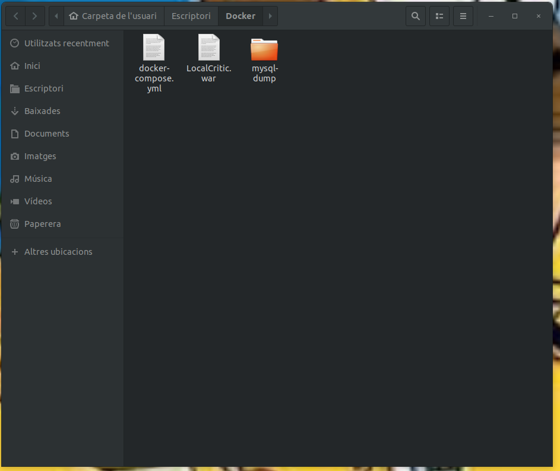

## DockerExamen

## 1- Introducción.
El desplegar aplicaciones con docker es importante, debido a que proporciona al usuario una facilidad para usar nuestro proyecto sin problemas de compatibilidad, lo primero que hay que hacer es tener a nuestra disposición el proyecto con el compose

## 2- Configuración del archivo docker-compose.yml.
El archivo docker-compose.yml será esencial en este proceso, ya que desplegará todas las imágenes necesarias.

===========================================================================================================================
# versión de compose 3.3
version: '3.3'
services:
    db:
# nombre del contenedor, este será el nombre con el que se desplegará
        container_name: db
# servicio mysql
        image: mysql
        restart: always
        ports:
# esta base de datos se añadirá en el puerto 3307 apuntando al 3306
            - "3307:3306"
# volumen de tablas de mysql
        volumes:
            - ./mysql-dump:/docker-entrypoint-initdb.d
        environment:

# base de datos de nombre "LocalCritic"
            MYSQL_DATABASE: LocalCritic
# parámetros de usuario
            MYSQL_USER: admin
            MYSQL_PASSWORD: 1234
            MYSQL_ROOT_PASSWORD: root
    phpmyadmin:
# contenedor depende de la base de datos
        depends_on: 
            - db
# imagen con nombre phpmyadmin
        container_name: phpmyadmin
# la imagen será phpmyadmib
        image: phpmyadmin/phpmyadmin
        restart: always
# esta aplicación de manejo de base de datos inicia el puerto web a través del 8080
        ports:
            - "8082:80"
        environment:
# parámetros de usuario
            MYSQL_ROOT_PASSWORD: root 
            PMA_HOST: db
    tomcat:
# tomcat 10
           image: tomcat:10.0
# puerto 8080 en 8080
           ports:
               - "8080:8080"
# volumen para aplicación java del proyecto
           volumes:
               - ./LocalCritic.war:/usr/local/tomcat/webapps/LocalCritic.war
# nombre tomcat
           container_name: tomcat
           environment:
# base de datos LocalCritic
            MYSQL_DATABASE: LocalCritic
# parámetros de usuario
            MYSQL_USER: admin
            MYSQL_PASSWORD: 1234
            MYSQL_ROOT_PASSWORD: root
===============================================================================================================

## 3- Pasos para el despliegue de la aplicación.

## 4- Preparación y subida de la imagen a dockerhub.

## 5- Conclusiones
